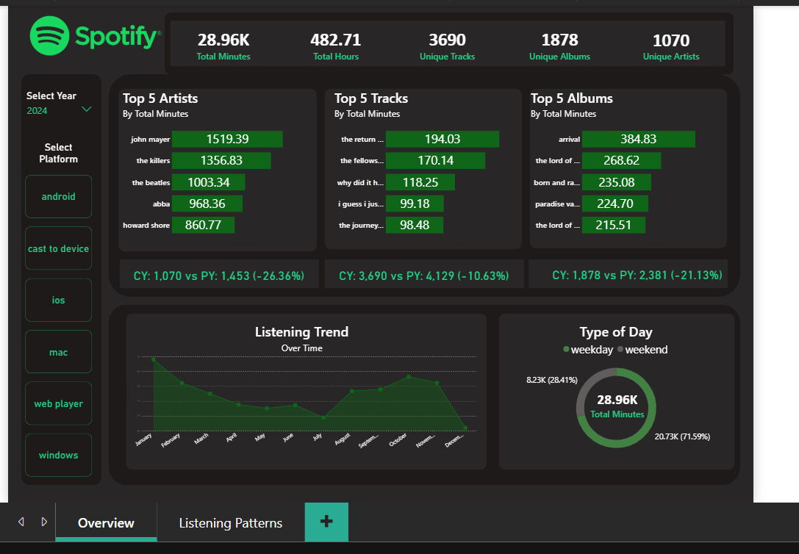
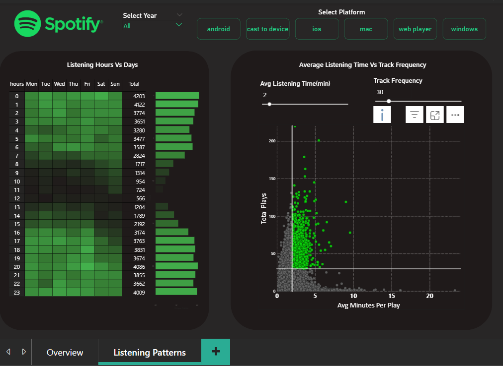

# Spotify-Analytics-Project

End-to-end Spotify listening analytics using **Python, MySQL, and Power BI**.

---

##  Project Overview

This project analyzes **10+ years of Spotify streaming history (2013–2024)** to uncover listening patterns, favorite artists, and platform usage.
It demonstrates an end-to-end analytics workflow:

1. **Python** → data cleaning and preprocessing
2. **MySQL** → database modeling and SQL analysis
3. **Power BI** → dashboarding and business insights

The goal was to replicate a **real-world analytics project** and present results in both:

* **Technical format** (SQL + relational schema)
* **Business-friendly format** (interactive dashboards)

---

## Tools & Technologies

* **Python** (Pandas, NumPy, SQLAlchemy) → data cleaning, transformations
* **MySQL** → relational schema, queries, analysis
* **Power BI** → dashboarding, KPI visualization
* **GitHub** → version control, portfolio presentation

---

## Repository Structure

```
spotify-analytics-project/
│
├── Python/                         # Data cleaning script
│   └── spotify_clean_python_script.py
│
├── spotify_raw_data/                # Raw Spotify export
│   └── spotify_history_raw.csv
│
├── sql/                             # ERD and queries
│   ├── spotify_analysis_queries.md
│   └── imageserd_dbdiagram.png.pdf
│
├── sql_results/                     # Outputs of SQL queries
│   ├── q1_top_artists.csv
│   ├── q2_top_albums.csv
│   ├── q3_top_tracks.csv
│   └── ... up to q12
│
├── power_bi/                        # Power BI dashboard
│   ├── Spotify_portfolio_project.pbix
│   ├── Spotify_dashboard_page1.png
│   └── Spotify_dashboard_page2.png
│
└── README.md                        # Project documentation
```

---

##  Data Cleaning (Python)

Steps performed in **spotify_clean_python_script.py**:

1. Parsed timestamps into date, time, year, quarter, etc.
2. Created derived features: weekday/weekend, time of day buckets.
3. Removed invalid rows (`ms_played = 0`) and duplicates.
4. Calculated duration in minutes and hours.
5. Exported cleaned dataset into **MySQL** and **CSV** for analysis.

 [spotify_clean_python_script.py](Python/spotify_clean_python_script.py)

---

##  Database Design (MySQL)

1. **Star Schema design**:

   * **Fact Table** → `listening_history` (plays, durations, foreign keys)
   * **Dimension Tables** → `artist_info`, `album_info`, `track_info`, `platform_info`, `date_info`, `time_info`

2. **Entity-Relationship Diagram (ERD):**
   [erd_diagram.png.pdf](sql/imageserd_dbdiagram.png.pdf)

---

##  Business Questions Answered with SQL

Documented in [spotify_analysis_queries.md](sql/spotify_analysis_queries.md).
Each query links to a CSV output in `sql_results/`.

**Examples of key analyses:**

* Top 3 artists, albums, and tracks per year
* Artists appearing as #1 across multiple years
* Yearly listening growth
* Most-used platforms per year
* Average listening session length by platform
* Weekday vs weekend listening
* Most active time of day
* Top artist per platform
* Most frequently played track (by count)
* Highest listening quarter per year

---

##  Dashboard (Power BI)

Interactive dashboard built in **Power BI** with:

* KPIs → total minutes, hours, unique tracks, albums, artists
* Top 5 Artists/Albums/Tracks by minutes
* Yearly & Monthly Listening Trends
* Weekend vs Weekday breakdown
* Heatmap → listening hours vs days
* Scatter plot → average minutes per play vs total plays

👉 [Spotify_portfolio_project.pbix](power_bi/Spotify_portfolio_project.pbix)

⚠️ Note: `.pbix` cannot be previewed on GitHub.
To open, download and open in **Power BI Desktop**.

**Screenshots:**



---

## 🖥 How to Reproduce

1. **Clone the repo**

   ```bash
   git clone https://github.com/<your-username>/Spotify-Analytics-Project.git
   cd Spotify-Analytics-Project
   ```

2. **Install dependencies**

   ```bash
   pip install -r requirements.txt
   ```

3. **Run the Python script**

   ```bash
   python Python/spotify_clean_python_script.py
   ```

4. **Load the cleaned data** into MySQL using the provided schema.

5. **Open the Power BI dashboard** and connect it to MySQL or the exported CSVs.

---

##  Future Improvements

* Automate ETL pipeline with **Airflow** or **dbt**
* Deploy dashboard on **Power BI Service** or **Tableau Public**
* Enrich with **Spotify API metadata** (genres, popularity, etc.)
* Perform **predictive modeling** for listening trends

---

##  Key Takeaways

* Full **end-to-end workflow**: Python → SQL → Power BI
* Strong focus on **data modeling (Star Schema)**
* Answered **business-style questions** with SQL
* Delivered a polished **dashboard for stakeholders**


